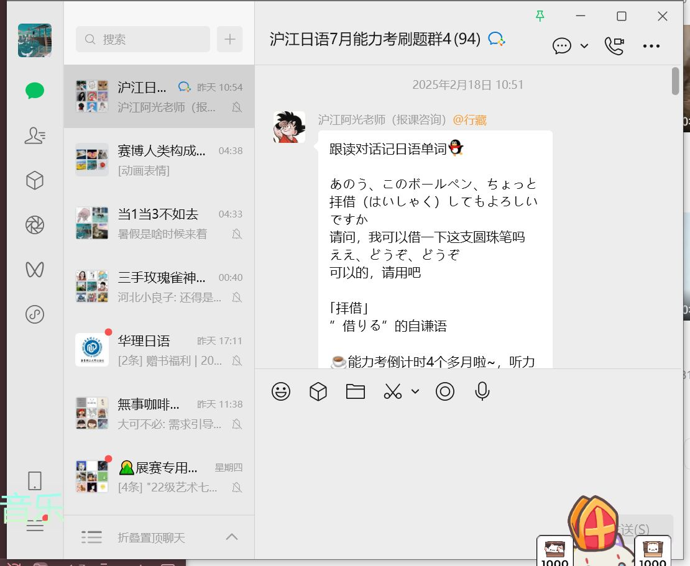

コンクールの結果（けっか）はどうでしたか。
案（あん）の定（じょう）、林（はやし）さんが１位に（いちい）なりましたよ
やはり予想（よそう）通（どお）りでしたね

比赛结果怎么样？
——果然不出所料，小林得了第一名。
果然和预想的一样呢。

｢ #案の定 ｣[日语对话跟读26.4.3.mp3](file:///D:/xwechat_files/wxid_4y7wmia7mfan22_8f44/msg/file/2026-04/%E6%97%A5%E8%AF%AD%E5%AF%B9%E8%AF%9D%E8%B7%9F%E8%AF%BB26.4.3.mp3)
果然，不出所料

あっさりした味付（あじつ）けだね。
うん、調味料（ちょうみりょう）を少（すく）な目（め）にしたんだ。 
味道挺清淡的呢。
嗯，我少放了一点调味料。

｢ #あっさり ｣[日语例句跟读26.4.2.mp3](file:///D:/xwechat_files/wxid_4y7wmia7mfan22_8f44/msg/file/2026-04/%E6%97%A5%E8%AF%AD%E4%BE%8B%E5%8F%A5%E8%B7%9F%E8%AF%BB26.4.2.mp3)
清淡的样子

この紙（かみ）は、つるつるして光（ひか）っている方（ほう）が表（おもて）です
这张纸光滑、发亮的一面是正面

｢ #つるつる ｣[つるつる.MP3](file:///D:/xwechat_files/wxid_4y7wmia7mfan22_8f44/msg/file/2026-01/%E3%81%A4%E3%82%8B%E3%81%A4%E3%82%8B.MP3)
滑溜溜地

どこか景色（けしき）のいい所（ところ）で一休（ひとやす）みしましょう
找个风景好的地方休息一下吧

｢ #一休み ｣[一休み.MP3](file:///D:/xwechat_files/wxid_4y7wmia7mfan22_8f44/msg/file/2026-01/%E4%B8%80%E4%BC%91%E3%81%BF.MP3)
休息片刻，歇一会儿

知（し）らない所（ところ）では、どちらが西（にし）か東（ひがし）かさっぱり見当（けんとう）がつかない
在不熟悉的地方，完全分不清哪边是东哪边是西。

｢ #見当がつかない ｣[見当がつかない.MP3](file:///D:/xwechat_files/wxid_4y7wmia7mfan22_8f44/msg/file/2026-01/%E8%A6%8B%E5%BD%93%E3%81%8C%E3%81%A4%E3%81%8B%E3%81%AA%E3%81%84.MP3)
毫无头绪／完全摸不着头脑

プライバシーにかかわることにはお答（こた）えできません
涉及隐私的问题，恕我无法回答。

｢ #プライバシー ｣[プライバシー.MP3](file:///D:/xwechat_files/wxid_4y7wmia7mfan22_8f44/msg/file/2026-01/%E3%83%97%E3%83%A9%E3%82%A4%E3%83%90%E3%82%B7%E3%83%BC.MP3)
个人隐私

電車（でんしゃ）の中（なか）は公共（こうきょう）の場（ば）であるから、大声（おおごえ）を出（だ）すべきではない
电车里是公共场所，所以不应该大声喧哗

｢ #公共の場 ｣[公共の場.MP3](file:///D:/xwechat_files/wxid_4y7wmia7mfan22_8f44/msg/file/2026-01/%E5%85%AC%E5%85%B1%E3%81%AE%E5%A0%B4.MP3)
公共场所

収入（しゅうにゅう）が減（へ）ってしまったので、毎日（まいにち）節約（せつやく）に努（つと）めている
因为收入减少了，所以每天都在努力节约开支。

｢ #努める ｣[努める.MP3](file:///D:/xwechat_files/wxid_4y7wmia7mfan22_8f44/msg/file/2026-01/%E5%8A%AA%E3%82%81%E3%82%8B.MP3)
努力，尽力

だんだん伸（の）びてきた前髪（まえがみ）が、うっとうしくなってきた
渐渐长出来的刘海变得有点烦人了

｢ #うっとうしい ｣[うっとうしい.MP3](file:///D:/xwechat_files/wxid_4y7wmia7mfan22_8f44/msg/file/2025-12/%E3%81%86%E3%81%A3%E3%81%A8%E3%81%86%E3%81%97%E3%81%84.MP3)
令人厌烦的，讨厌的

身長（しんちょう）と体重（たいじゅう）は、必（かなら）ずしも比例（ひれい）するわけではない
身高和体重未必成正比

｢ #必ずしも ｣[必ずしも.MP3](file:///D:/xwechat_files/wxid_4y7wmia7mfan22_8f44/msg/file/2025-12/%E5%BF%85%E3%81%9A%E3%81%97%E3%82%82.MP3)
（后接否定）未必，不一定

そのような考（かんが）え方（かた）はもはや時代遅（じだいおく）れだ
那种想法已经过时了

｢ #時代遅れ ｣[時代遅れ.MP3](file:///D:/xwechat_files/wxid_4y7wmia7mfan22_8f44/msg/file/2025-12/%E6%99%82%E4%BB%A3%E9%81%85%E3%82%8C.MP3)
落伍，过时

日中（にっちゅう）は暑（あつ）いが、朝夕（あさゆう）は大分（だいぶ）涼（すず）しくなった
白天虽然很热，但早晚已经凉快了不少

｢ #大分 ｣
很，相当[大分.MP3](file:///D:/xwechat_files/wxid_4y7wmia7mfan22_8f44/msg/file/2025-11/%E5%A4%A7%E5%88%86.MP3)

止（と）まっていた電車（でんしゃ）が突如（とつじょ）動（うご）き出（だ）した
停着的电车突然动了起来

｢ #突如 ｣
冷不防，突然[突如.MP3](file:///D:/xwechat_files/wxid_4y7wmia7mfan22_8f44/msg/file/2025-11/%E7%AA%81%E5%A6%82.MP3)

昨日（きのう）、大阪（おおさか）から名古屋（なごや）に転居（てんきょ）しました
昨天我从大阪搬到名古屋了

｢ #転居 ｣
搬家，乔迁[転居.MP3](file:///D:/xwechat_files/wxid_4y7wmia7mfan22_8f44/msg/file/2025-11/%E8%BB%A2%E5%B1%85.MP3)

彼（かれ）の言（い）っていることは、半分（はんぶん）以上（いじょう）うそだと睨（にら）んでいる
我觉得他的话有一半以上是假的

｢ #睨む ｣
推测，估计[睨む.MP3](file:///D:/xwechat_files/wxid_4y7wmia7mfan22_8f44/msg/file/2025-11/%E7%9D%A8%E3%82%80.MP3)

私（わたし）は、小学校（しょうがっこう）で六年生（ろくねんせい）のクラスを受（う）け持（も）っている
我在小学里负责六年级的班级

｢ #受け持つ ｣[受け持つ.MP3](file:///D:/xwechat_files/wxid_4y7wmia7mfan22_8f44/msg/file/2025-11/%E5%8F%97%E3%81%91%E6%8C%81%E3%81%A4.MP3)
担任，负责

寒（さむ）さで手（て）が凍（こご）えてよく動（うご）かない
因为太冷，手冻僵了不太灵活

｢ #凍える ｣[凍える.MP3](file:///D:/xwechat_files/wxid_4y7wmia7mfan22_8f44/msg/file/2025-11/%E5%87%8D%E3%81%88%E3%82%8B.MP3)
冻僵

土砂降（どしゃぶ）りの中（なか）で試合（しあい）が続（つづ）き、選手（せんしゅ）たちは皆（みな）泥（どろ）まみれだ
比赛在大雨中继续着，选手们全都弄得满身泥巴

｢ #土砂降り ｣[土砂降り.MP3](file:///D:/xwechat_files/wxid_4y7wmia7mfan22_8f44/msg/file/2025-11/%E5%9C%9F%E7%A0%82%E9%99%8D%E3%82%8A.MP3)
倾盆大雨

当店（とうてん）は、本日（ほんじつ）をもって閉店（へいてん）することになりました
本店自今日起停止营业

｢ #～をもって ｣[～をもって.MP3](file:///D:/xwechat_files/wxid_4y7wmia7mfan22_8f44/msg/file/2025-11/%EF%BD%9E%E3%82%92%E3%82%82%E3%81%A3%E3%81%A6.MP3)
表示时间的终点

話（はなし）がはずんで、時間（じかん）を忘（わす）れてしまった
聊得太起劲儿了，忘记了时间

｢ #話がはずむ ｣[話がはずむ.MP3](file:///D:/xwechat_files/wxid_4y7wmia7mfan22_8f44/msg/file/2025-10/%E8%A9%B1%E3%81%8C%E3%81%AF%E3%81%9A%E3%82%80.MP3)
谈得投机，谈得起劲儿

新（あたら）しい事業（じぎょう）なので、社員（しゃいん）全員（ぜんいん）が手（て）さぐりで仕事（しごと）にあたっている
因为是新业务，所有员工都在摸索着开展工作

｢手さぐり｣[手さぐり.MP3](file:///D:/xwechat_files/wxid_4y7wmia7mfan22_8f44/msg/file/2025-09/%E6%89%8B%E3%81%95%E3%81%90%E3%82%8A.MP3)
摸索，探索

ここは飲食店（いんしょくてん）を開（ひら）くのにはうってつけの場所（ばしょ）だ
这里是开餐饮店的绝佳地点

｢うってつけ｣[うってつけ.MP3](file:///D:/xwechat_files/wxid_4y7wmia7mfan22_8f44/msg/file/2025-09/%E3%81%86%E3%81%A3%E3%81%A6%E3%81%A4%E3%81%91.MP3)
适合，恰当

教授（きょうじゅ）は授業中（じゅぎょうちゅう）に私語（しご）をしていた学生（がくせい）を睨（にら）みつけた
教授在上课时瞪了一眼交头接耳的学生

｢睨みつける｣[睨みつける.MP3](file:///D:/xwechat_files/wxid_4y7wmia7mfan22_8f44/msg/file/2025-08/%E7%9D%A8%E3%81%BF%E3%81%A4%E3%81%91%E3%82%8B.MP3)
瞪，怒目而视

規則（きそく）というものは、現状（げんじょう）に即（そく）して改（あらた）めていく必要（ひつよう）がある
规则必须根据实际情况不断调整完善

｢即する｣[即する.mp3](file:///D:/xwechat_files/wxid_4y7wmia7mfan22_8f44/msg/file/2025-07/%E5%8D%B3%E3%81%99%E3%82%8B.mp3)
根据，结合

子育（こそだ）てに関（かん）する意見（いけん）の食（く）い違（ちが）いで、離婚（りこん）することになった
因为育儿意见的分歧，最终导致了离婚

｢食い違い｣[食い違い.mp3](file:///D:/xwechat_files/wxid_4y7wmia7mfan22_8f44/msg/file/2025-07/%E9%A3%9F%E3%81%84%E9%81%95%E3%81%84.mp3)
分歧，不一致

隣（となり）の犬（いぬ）が夜中（よなか）に吠（ほ）えて、うるさくてかなわない
隔壁的狗半夜狂吠，吵得人实在受不了

｢～てかなわない｣[てかなわない.mp3](file:///D:/xwechat_files/wxid_4y7wmia7mfan22_8f44/msg/file/2025-07/%E3%81%A6%E3%81%8B%E3%81%AA%E3%82%8F%E3%81%AA%E3%81%84.mp3)
吃不消，受不了

歩（ある）いていたら、へびが出（で）てきたので、ぎょっとした
走着走着，突然出现了一条蛇，吓了我一跳

｢ぎょっと｣[ぎょっと.MP3](file:///D:/xwechat_files/wxid_4y7wmia7mfan22_8f44/msg/file/2025-07/%E3%81%8E%E3%82%87%E3%81%A3%E3%81%A8.MP3)
大吃一惊，吓一跳

積年（せきねん）の思（おも）いがかなって、自分（じぶん）の家（いえ）が持（も）てた
多年的愿望终于实现，拥有了自己的房子

｢積年｣[積年.MP3](file:///D:/xwechat_files/wxid_4y7wmia7mfan22_8f44/msg/file/2025-06/%E7%A9%8D%E5%B9%B4.MP3)
多年 

彼（かれ）の机（つくえ）の引（ひ）き出（だ）しの中（なか）は、いつもごちゃごちゃだ
他桌子抽屉里总是乱七八糟的

｢ごちゃごちゃ｣[ごちゃごちゃ.MP3](file:///D:/xwechat_files/wxid_4y7wmia7mfan22_8f44/msg/file/2025-04/%E3%81%94%E3%81%A1%E3%82%83%E3%81%94%E3%81%A1%E3%82%83.MP3)
凌乱，杂乱

「お母（かあ）さん、このおもちゃ、壊（こわ）れちゃったみたい。スイッチを入（い）れても動（うご）かないんだ」
妈妈，这个玩具好像坏掉了。开关打开也动不了了
「乱暴（らんぼう）にするからすぐに壊（こわ）れるのよ！」
 就是因为你太粗暴了才这么快就坏掉的啊

｢乱暴｣[乱暴.mp3](file:///D:/xwechat_files/wxid_4y7wmia7mfan22_8f44/msg/file/2025-04/%E4%B9%B1%E6%9A%B4.mp3)
粗暴，粗鲁 

社員総出（しゃいんそうで）で、どんな新商品（しんしょうひん）を開発（かいはつ）しようかとあれこれ考（かんが）えても、なかなか名案（めいあん）が出（で）てこない。
即使全体员工总动员，绞尽脑汁地思考该开发什么新产品，也很难想出一个好点子。

｢名案｣[名案.mp3](file:///D:/xwechat_files/wxid_4y7wmia7mfan22_8f44/msg/file/2025-04/%E5%90%8D%E6%A1%88.mp3)
好主意。好的提议。 

向（む）かいの家（いえ）はカーテンをまったく閉（し）めないので、部屋（へや）の中（なか）が丸見（まるみえ）えだ。
对面的房子完全不拉窗帘，屋里的一切都看得一清二楚

｢丸見え｣[丸見え.mp3](file:///D:/xwechat_files/wxid_4y7wmia7mfan22_8f44/msg/file/2025-04/%E4%B8%B8%E8%A6%8B%E3%81%88.mp3)
全部看得见

近（ちか）くに、同（おな）じような店（みせ）を何軒（なんけん）も出（だ）されると、うちの店（みせ）の売（う）り上（あ）げがガタ落（お）ちになる。
如果附近开了好几家类似的店，我们的营业额就会大幅下滑。

｢がた落ち｣[がた落ち.mp3](file:///D:/xwechat_files/wxid_4y7wmia7mfan22_8f44/msg/file/2025-04/%E3%81%8C%E3%81%9F%E8%90%BD%E3%81%A1.mp3)
东西的量、价值等急剧减少。

車（くるま）の中（なか）に置（お）き忘（わす）れたチョコレートが溶（と）けてべとべとになっちゃった。
忘在车里的巧克力融化了，变得黏糊糊的。

｢べとべと｣[べとべと.mp3](file:///D:/xwechat_files/wxid_4y7wmia7mfan22_8f44/msg/file/2025-04/%E3%81%B9%E3%81%A8%E3%81%B9%E3%81%A8.mp3)
黏糊糊

疲（つか）れを取（と）るには暖（あたた）かい温泉（おんせん）に浸かるのが一番（いちばん）だ。
泡温泉是消除疲劳最好的方法。

｢浸かる｣[浸かる.mp3](file:///D:/xwechat_files/wxid_4y7wmia7mfan22_8f44/msg/file/2025-04/%E6%B5%B8%E3%81%8B%E3%82%8B.mp3)
 浸，泡

締（し）め切（き）り直前（ちょくぜん）になってから仕事（しごと）にとりかかるのは、よくないと思（おも）う
我觉得临近截止日期才开始着手工作是不太好的

｢とりかかる｣[取り掛かる.mp3](file:///D:/xwechat_files/wxid_4y7wmia7mfan22_8f44/msg/file/2025-04/%E5%8F%96%E3%82%8A%E6%8E%9B%E3%81%8B%E3%82%8B.mp3)
开始做，着手

500（ごひゃく）ページにも上（のぼ）る長編小説（ちょうへんしょうせつ）を、二日（ふつか）で読（よ）み終（お）えた。
 两天就读完了长达500页的长篇小说

｢上る｣[上る.mp3](file:///D:/xwechat_files/wxid_4y7wmia7mfan22_8f44/msg/file/2025-04/%E4%B8%8A%E3%82%8B.mp3)
数量结果达到某个很大的数值

2人（ふたり）は曲（ま）がり角（かど）で危（あや）うくぶつかりそうになった。
两个人在拐角处差点撞上。

｢危うく｣[あやうく.mp3](file:///D:/xwechat_files/wxid_4y7wmia7mfan22_8f44/msg/file/2025-04/%E3%81%82%E3%82%84%E3%81%86%E3%81%8F.mp3)
险些，差一点

明日（あした）の試験（しけん）、時間（じかん）が足（た）りるかな
明天的考试时间够吗？
心配（しんぱい）なら、難（むずか）しい問題（もんだい）は最後（さいご）に回（まわ）して、できる問題（もんだい）から先（さき）にやったほうがいいよ
如果担心的话，可以把难题留到最后，先做会做的题目比较好哦

｢足りる｣[足りる.mp3](file:///D:/xwechat_files/wxid_4y7wmia7mfan22_8f44/msg/file/2025-04/%E8%B6%B3%E3%82%8A%E3%82%8B.mp3)
够，充分

子（こ）ども４人（よにん）の家庭（かてい）は、どれくらいの収入（しゅうにゅう）があればやっていけると思（おも）いますか？
有四个孩子的家庭，需要多少收入才能维持生活呢？
ケースバイケースですし、私（わたし）には何（なん）とも言（い）えませんね
这个要看具体情况，我也不好说

｢ケースバイケース｣[ケースバイケース.mp3](file:///D:/xwechat_files/wxid_4y7wmia7mfan22_8f44/msg/file/2025-04/%E3%82%B1%E3%83%BC%E3%82%B9%E3%83%90%E3%82%A4%E3%82%B1%E3%83%BC%E3%82%B9.mp3)
看具体情况（case by case）

リンゴを素手（すで）で割（わ）ろうと思（おも）っても、なかなか割（わ）れないものだ。
想徒手劈开苹果，但不是件容易的事。
｢素手｣[素手.mp3](file:///D:/xwechat_files/wxid_4y7wmia7mfan22_8f44/msg/file/2025-04/%E7%B4%A0%E6%89%8B.mp3)
徒手，赤手空拳

説明会（せつめいかい）に申込（もうしこ）みたいのですが、受（う）け付（つ）けはこちらでしょうか
我想报名参加说明会，是在这里登记吗？
事前（じぜん）の申（もう）し込（こ）みは不要（ふよう）ですよ
本次说明会无需提前报名哦

｢不要｣[不要.MP3](file:///D:/xwechat_files/wxid_4y7wmia7mfan22_8f44/msg/file/2025-03/%E4%B8%8D%E8%A6%81.MP3)
不需要，不必要 

女：今日（きょう）届（とど）いたかばん、思（おも）ったよりも小（ちい）さかったの。財布（さいふ）がやっと入（はい）るくらい。
今天收到的包比我想象的要小。勉强能放下钱包。
男：この間（あいだ）買（か）った服（ふく）は色（いろ）が暗（くら）いって別（べつ）の色（いろ）に交換（こうかん）してたよね。今回（こんかい）も大（おお）きいサイズに交換（こうかん）すれば？
你之前不是嫌买的衣服颜色太暗，换了别的颜色吗？这次也换个大号的吧？
女：その時（とき）は、店（みせ）が注文（ちゅうもん）した色（いろ）と違（ちが）うものを送（おく）ってきたから交換（こうかん）が無料（むりょう）だったの。買（か）った人（ひと）の都合（つごう）で交換（こうかん）する場合（ばあい）はお金（かね）がかかるのよ。
那次是因为店家送的颜色和订购的不一样，所以才能免费换。如果是自己要求换尺寸的话，可是要花钱的哦

｢交換｣[交換.MP3](file:///D:/xwechat_files/wxid_4y7wmia7mfan22_8f44/msg/file/2025-03/%E4%BA%A4%E6%8F%9B.MP3)
交换，互换

吉田（よしだ）さんの顔（かお）が真（ま）っ青（さお）ですね。大丈夫（だいじょうぶ）でしょうか。
吉田脸色苍白，没事吧？
今（いま）にも倒（たお）れそうですね。
看起来快要倒下了呢

｢真っ青｣[真っ青.MP3](file:///D:/xwechat_files/wxid_4y7wmia7mfan22_8f44/msg/file/2025-03/%E7%9C%9F%E3%81%A3%E9%9D%92.MP3)
苍白，血色减退，脸色非常不好
｢今にも｣
就要，马上

申（もう）し訳（わけ）ございません、こちらの品物（しなもの）は機内（きない）持（も）ち込（こ）み禁止（きんし）となっております
非常抱歉，这件物品是禁止随身带上飞机的
うっかりしていました
是我不小心疏忽了

｢品物｣
东西，物品
｢うっかり｣[うっかり.MP3](file:///D:/xwechat_files/wxid_4y7wmia7mfan22_8f44/msg/file/2025-03/%E3%81%86%E3%81%A3%E3%81%8B%E3%82%8A.MP3)
马虎，不留神 

昨日（きのう）の試合（しあい）は、思（おも）いがけない結果（けっか）になったね
昨天的比赛结果真是出乎意料啊
まさか、あのチームが負（ま）けるとはね
真没想到那支队伍居然会输

｢思いがけない｣[思いがけない.MP3](file:///D:/xwechat_files/wxid_4y7wmia7mfan22_8f44/msg/file/2025-03/%E6%80%9D%E3%81%84%E3%81%8C%E3%81%91%E3%81%AA%E3%81%84.MP3)
没料到的，意外的

そんなに忙（いそが）しいの？週末（しゅうまつ）だってろくに休（やす）んでないじゃない？
你最怎么那么忙？连周末都没好好休息过吧？
大丈夫（だいじょうぶ）よ。若（わか）いんだから
没事啦，毕竟还年轻嘛

｢ろくに｣[ろくに.MP3](file:///D:/xwechat_files/wxid_4y7wmia7mfan22_8f44/msg/file/2025-03/%E3%82%8D%E3%81%8F%E3%81%AB.MP3)
(下接否定语)充分地，满足地

早（はや）く着（つ）いたので、本屋（ほんや）で時間（じかん）をつぶしてました
到得早了，就在书店打发时间了
あっ、お待（ま）たせしちゃったんですね
啊，让您久等了

｢時間をつぶす｣[時間をつぶす.MP3](file:///D:/xwechat_files/wxid_4y7wmia7mfan22_8f44/msg/file/2025-03/%E6%99%82%E9%96%93%E3%82%92%E3%81%A4%E3%81%B6%E3%81%99.MP3)
消磨时间，打发时间

あいにく、今（いま）担当（たんとう）の者（もの）が出払（ではら）っております
不巧，现在负责人都外出了
いつごろお戻（もど）りになりますか
请问大概什么时候回来呢

｢出払う｣[出払う.MP3](file:///D:/xwechat_files/wxid_4y7wmia7mfan22_8f44/msg/file/2025-03/%E5%87%BA%E6%89%95%E3%81%86.MP3)
人或物等全都出去，一点也没留下

佐藤（さとう）さん、さっき早退（そうたい）してたけど、もしかして仮病（けびょう）だったりして
佐藤刚才早退了，该不会是在装病吧？
うん、さっきまでピンピンしてたよね
就是啊，刚刚还活蹦乱跳的呢。

｢ぴんぴん｣[ぴんぴん.MP3](file:///D:/xwechat_files/wxid_4y7wmia7mfan22_8f44/msg/file/2025-03/%E3%81%B4%E3%82%93%E3%81%B4%E3%82%93.MP3)
精神抖擞，活蹦乱跳

あの人（ひと）、一円（いちえん）たりとも出（だ）さない気（き）だよ
那个人，一毛钱都不打算出
ケチな人（ひと）だね
真扣啊

｢たりとも｣[たりとも.MP3](file:///D:/xwechat_files/wxid_4y7wmia7mfan22_8f44/msg/file/2025-03/%E3%81%9F%E3%82%8A%E3%81%A8%E3%82%82.MP3)
即使是，纵然是

例（れい）の仕事（しごと）、伊藤（いとう）さん、しぶしぶだけど、引（ひ）き受（う）けてくれたよ
那件工作，伊藤虽然不太情愿，但还是答应接手了哦
無理（むり）やり頼（たの）んだんじゃないの
你该不会是硬要人家答应的吧？

｢しぶしぶ｣[しぶしぶ.MP3](file:///D:/xwechat_files/wxid_4y7wmia7mfan22_8f44/msg/file/2025-03/%E3%81%97%E3%81%B6%E3%81%97%E3%81%B6.MP3)
勉勉强强，不心甘情愿
｢むりやり｣
强行，强迫

あの人（ひと）、毎日（まいにち）のように何（なに）か借（か）りに来（く）るよね
那个人几乎每天都来借东西呢
厚（あつ）かましいったらないんだから
真是厚颜无耻到极点了

｢厚かましい｣[厚かましい.MP3](file:///D:/xwechat_files/wxid_4y7wmia7mfan22_8f44/msg/file/2025-03/%E5%8E%9A%E3%81%8B%E3%81%BE%E3%81%97%E3%81%84.MP3)
厚颜无耻，厚脸皮

実（じつ）は、一身上（いっしんじょう）の理由（りゆう）で残念（ざんねん）ながら今月（こんげつ）いっぱいで辞（や）めさせていただくことになりました
其实，因为个人原因，很遗憾这个月底就要离职了
えっ？いったいどうしたの
哎？发生什么事了？

｢一身上｣[一身上.MP3](file:///D:/xwechat_files/wxid_4y7wmia7mfan22_8f44/msg/file/2025-03/%E4%B8%80%E8%BA%AB%E4%B8%8A.MP3)
与个人处境有关的事

この白（しろ）いシャツ、ちょっと黄（き）ばんじゃってるね
这件白衬衫有点发黄了呢。
あら、漂白剤（ひょうはくざい）を使（つか）って、洗（あら）ってみようか
哎呀，用漂白剂洗洗看吧？

｢黄ばむ｣[黄ばむ.MP3](file:///D:/xwechat_files/wxid_4y7wmia7mfan22_8f44/msg/file/2025-03/%E9%BB%84%E3%81%B0%E3%82%80.MP3)
发黄，变黄

これ以上（いじょう）の値引（ねび）きはいたしかねます。
价格不能再降了
そこを何（なん）とか、お願（ねが）いします。
请您再通融一下

｢値引き｣[値引き.MP3](file:///D:/xwechat_files/wxid_4y7wmia7mfan22_8f44/msg/file/2025-02/%E5%80%A4%E5%BC%95%E3%81%8D.MP3)
降价，减价
｢～かねる｣
不能~，难以~

この植物（しょくぶつ）、育（そだ）つのが早（はや）いね。
这种植物长得好快啊
うん、ぐんぐん伸（の）びているね。
是啊，正蹭蹭地往上长呢

｢ぐんぐん｣[ぐんぐん.MP3](file:///D:/xwechat_files/wxid_4y7wmia7mfan22_8f44/msg/file/2025-02/%E3%81%90%E3%82%93%E3%81%90%E3%82%93.MP3)
猛地，突飞猛进的样子

あの人（ひと）、歌（うた）が上手（じょうず）だよね。プロかな。
那个人歌唱得真好，是专业的吗
いや、アマチュアらしいですよ。
不是，好像是业余的

｢アマチュア｣[アマチュア.MP3](file:///D:/xwechat_files/wxid_4y7wmia7mfan22_8f44/msg/file/2025-02/%E3%82%A2%E3%83%9E%E3%83%81%E3%83%A5%E3%82%A2.MP3)
业余爱好者

翻訳（ほんやく）というものは、ただでさえ難（むずか）しいものなのに、ましてや古典（こてん）ともなればなおさらだろう
翻译本身就是一件困难的事情，更何况是古典作品，那就更加难上加难了。

｢ただでさえ｣[ただでさえ.mp3](file:///D:/xwechat_files/wxid_4y7wmia7mfan22_8f44/msg/file/2025-02/%E3%81%9F%E3%81%A0%E3%81%A7%E3%81%95%E3%81%88.mp3)
本来就～
｢ましてや｣
"まして"的强调说法。何况，况且
｢なおさら｣
更加，越发

あのう、このボールペン、ちょっと拝借（はいしゃく）してもよろしいですか
请问，我可以借一下这支圆珠笔吗
ええ、どうぞ、どうぞ
可以的，请用吧

｢拝借｣[拝借.MP3](file:///D:/xwechat_files/wxid_4y7wmia7mfan22_8f44/msg/file/2025-02/%E6%8B%9D%E5%80%9F.MP3)
”借りる”的自谦语 

あっさりした味付（あじつ）けだね。
うん、調味料（ちょうみりょう）を少（すく）な目（め）にしたんだ。 
味道挺清淡的呢。
嗯，我少放了一点调味料。

｢あっさり｣[日语例句跟读26.4.2.mp3](file:///D:/xwechat_files/wxid_4y7wmia7mfan22_8f44/msg/file/2026-04/%E6%97%A5%E8%AF%AD%E4%BE%8B%E5%8F%A5%E8%B7%9F%E8%AF%BB26.4.2.mp3)
清淡的样子

台風（たいふう）の影響（えいきょう）で、新幹線（しんかんせん）は軒並（のきな）み遅（おく）れが出（で）ている
受台风影响，新干线全部出现了延误

｢軒並み｣[日语例句跟读26.4.7.mp3](file:///D:/xwechat_files/wxid_4y7wmia7mfan22_8f44/msg/file/2026-04/%E6%97%A5%E8%AF%AD%E4%BE%8B%E5%8F%A5%E8%B7%9F%E8%AF%BB26.4.7.mp3)
所有，一律

そちらが値引（ねび）きしない限（かぎ）り、取（と）り引（ひ）きはしない
只要你们不降价，我们就不做这笔交易

｢値引き｣[日语例句跟读26.4.8.mp3](file:///D:/xwechat_files/wxid_4y7wmia7mfan22_8f44/msg/file/2026-04/%E6%97%A5%E8%AF%AD%E4%BE%8B%E5%8F%A5%E8%B7%9F%E8%AF%BB26.4.8.mp3)
降价，减价

過去（かこ）の失敗（しっぱい）はさておき、これからも新（あたら）しいことにチャレンジしたい
过去的失败暂且不论，我今后也想继续挑战新的事物

｢さておき｣[日语例句跟读26.4.10.mp3](file:///D:/xwechat_files/wxid_4y7wmia7mfan22_8f44/msg/file/2026-04/%E6%97%A5%E8%AF%AD%E4%BE%8B%E5%8F%A5%E8%B7%9F%E8%AF%BB26.4.10.mp3)
暂时撇开当前的话题

初（はじ）めての一人旅（ひとりたび）はまごつくことが多（おお）かった
第一次独自旅行，经常会不知所措

｢まごつく｣[日语例句跟读26.4.13.mp3](file:///D:/xwechat_files/wxid_4y7wmia7mfan22_8f44/msg/file/2026-04/%E6%97%A5%E8%AF%AD%E4%BE%8B%E5%8F%A5%E8%B7%9F%E8%AF%BB26.4.13.mp3)
惊慌失措，不知如何是好

彼（かれ）は高（たか）いコミュニケーション能力（のうりょく）を仕事（しごと）に生（い）かしている
他把高水平的沟通能力运用在工作中。

｢生かす｣[日语例句跟读26.4.14.mp3](file:///D:/xwechat_files/wxid_4y7wmia7mfan22_8f44/msg/file/2026-04/%E6%97%A5%E8%AF%AD%E4%BE%8B%E5%8F%A5%E8%B7%9F%E8%AF%BB26.4.14.mp3)
有效利用，充分发挥

プロジェクトが中止（ちゅうし）になって、肩（かた）を落（お）とした
项目被取消了，我感到很失落

｢肩を落とす｣[日语例句跟读26.4.16.mp3](file:///D:/xwechat_files/wxid_4y7wmia7mfan22_8f44/msg/file/2026-04/%E6%97%A5%E8%AF%AD%E4%BE%8B%E5%8F%A5%E8%B7%9F%E8%AF%BB26.4.16.mp3)
垂头丧气

到此