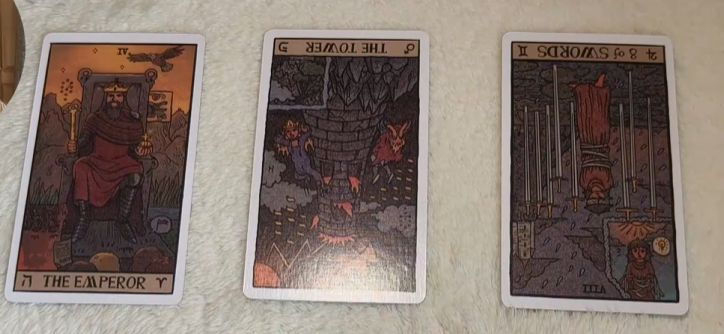
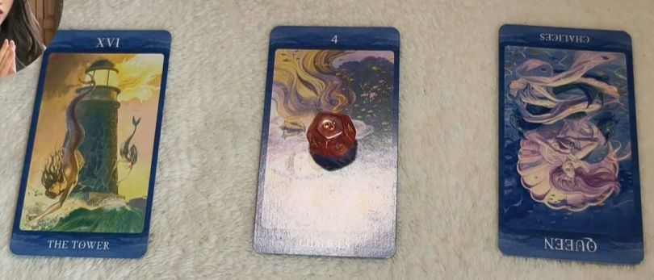

作家 严肃文学 共情 节奏 悲悯愤怒  希望 技巧 视角 震撼 核心 降维打击

## 全文摘要

当生活中遭遇重大挫折，一些人与写作结下了不解之缘，他们的创作源自于内心的苦痛与反思，被称为“源自苦难的文学”。尽管他们可能原本拥有正常的生活轨迹，但生活中的剧烈打击促使他们重新审视人生，进而被写作深深吸引，其写作不仅仅是职业选择，更是一种生命状态的体现，怀有强烈的社会责任感，渴望讲述那些常人难以触及的故事。这部分创作者往往展现出写作天赋，但他们的创作过程可能短暂而剧烈，一次性的爆发，耗尽所有情感与精力，然而，这些作品却因深刻的情感体验而具有强烈的感染力和冲击力。写作对他们而言，既是探索人性、面对生命苦痛的途径，也是与世界交流的重要桥梁，其独特的生活经历赋予作品深刻的内涵。
你是这种类型的作家，你是会呕心沥血的就把你的血肉交给你的人物，然后在你的情节当中让他们受到磨砺。而且我觉得你的节奏很好，就是你的写作天赋在于一种天然的节奏感的把控，让人看的时候情绪像过山车一样起伏。所以你去如果去写网文，那就是一种降维打击。因为现在网文就是讲究情绪好吗？所以说还是很厉害。而且基本上你的作品能够哪怕是短篇散文，他你的每一篇文章有一个文言，就感觉有一句核心。这一句核心能够就像一个石头，滚烫的石头就在别人心里滚过去，然后留下一道痕迹，所以很厉害。这一组没想到第一组就这么厉害，我看到的信息就是这样子了，希望对你有所帮助。
## 05:06一次性创作天才：核爆式作品与人生转折

你有成为作家的缘分。我觉得第一组的宝宝，首先我们来看你跟写作的缘分，什么样的情况下你才会开始写作？就是在你的工作在这种世俗的成就受到重创和打击之下，才会开始写作，就会有一种苦难诞生文学的感觉，施加不幸，施加信，就是你的感情到了不得不去抒发的地步，并且你只能通过文字去抒发的时候，你才会开始写作。你跟写作的缘分，我就感觉到这一组本来就是有可能你有自己的工作，有自己家的生活，不会一般来讲不会想到拐到协作这条路上去，就是正常的参与竞争，参与生活，直到你发现这样的生活受到了毁灭性的打击。当然其实高雅道具有时候讲的是价值观的颠覆，突然有一天发现我想要莲花里有一段话，我不记得记不记得起来，我翻一下我的胆小的本子，找到了追求一只名牌包，一辆名车，使你疲于奔命。离开城市之后，你会发现他的畸形和假象对人的智力是一种侮辱，就是这样的感觉。所以说你跟写作的缘分是不到特殊时期，它就像是一个安全气囊，而且它它的打开是伴随着剧烈的冲击。
## 写作与生命困境的深层联系

#皇帝牌TheEmoeror

你跟写作还有一个缘分是它可能是一次性的。你的某个阶段，你的价值观发生了一个巨大的改变，然后你有了不得不去写作和讲述的理由。然后就只有这一次，它是一次爆发式的，然后他就是昙花，也不昙花一现有什么？它是一场核爆，然后爆开之后是一片灰烬。你的所有的心血可能投注在一个作品当中之后，不管你是继续写还是封笔，它都是一种，再写下去你没有那股激情了。但是在写这一部作品的时候，你几乎就是燃烧生命。所以我觉得这一组还蛮蛮作家的，而且是那种很传奇色彩的这种写作的缘分OK。

1. 写作作为情感宣泄和心灵庇护所，在个人遭遇生活打击或价值观颠覆时成为重要出口，象征着从世俗成就转向内心世界的转折点。

2. 与写作的缘分被描述为一种使命和不得不表达的情感，即使在成功的职业生涯中，写作仍作为心灵的救生艇，陪伴度过人生风雨。

3. 写作对于个体而言，不仅是逃避现实的庇护所，更是经历人生挑战时的伴侣，帮助达到更高的人生目标，如功成名就或精神上的升华。

4. 写作的天赋和缘分可能是一次性的，历史上不乏仅有一部作品却影响深远的创作家，这暗示了深刻经历或情感转变后创作的爆发力。

5. 价值观的剧变或深刻情感经历成为不得不写作和讲述的强烈动机，写作成为个人成长和观念转变的重要载体，即使在看似与写作无关的领域取得成功，内心仍需通过文字寻找平衡和表达。

## 06:52 写作天赋与人性深处的探索

#高塔牌TheTower 

高塔牌象征的赤裸真实，以及对人性黑色内核的早期发现。这种黑色内核被比喻为每个人生命中的核心能源，尽管坚硬顽固且带有破坏性，它既是生命力的源泉，也具有潜在的破坏力。对人性复杂性的深刻认识，以及对探索自我深层次的鼓励与探索。

擅长严肃文学、苦难文学和转折性叙事，写作是生命选择，蕴含着对人性深处的探索。

## 07:24 关于写作的天赋，作品类型，在写作过程中可能会遇到什么挑战？

我拥有的写作天赋在于严肃文学，我的内心深不见底，像一片湖面，可以不断探索和挖掘，

这一组人确实适合写悲剧，特别是那种剧烈且爆裂的悲剧，比如《月亮与6便士》中男主人公画家因病痛而自我毁灭的场景。他们对苦难的感受敏锐，即使不亲身经历，也能通过共情捕捉到人类共同命运中的悲剧感。这一组人容易全身心投入写作，甚至可能会废寝忘食，写完后感到精力耗竭。历史上如写《包法利夫人》的作者因作品中的主角悲剧命运而深感触动落泪，余华写《活着》后也感慨万分。这类作家会将自己的情感和血肉融入角色和情节中，通过精心控制节奏感让读者情绪起伏，若从事网文写作，则具有明显的降维打击效果。

#占星八宫 和 #圣杯四牌

圣杯四牌代表的文艺傲慢，暗示作者内心深邃如无底湖。讨论了苦难对文学创作的催化作用，特别是剧烈悲剧的吸引力，以及对人类共同命运的共情能力。

历史上一些作家或艺术家一生仅留下一部知名作品的现象，但他们的创作过程可能短暂而剧烈，一次性核爆式创作耗尽所有情感与精力，可能继续写作但缺乏先前的激情，或选择封笔。
这种创作往往源于人生中某一剧烈而深刻的经历，导致价值观发生巨大改变，促使个人有强烈的表达欲望，将全部心血倾注于这一部作品中，这些作品却因深刻的情感体验而具有强烈的感染力和冲击力，从而形成传奇色彩的写作缘分。

#女皇牌Empress逆位
水元素，象征着情感与孕育。
金星主宰的天秤座和金牛座
混乱、无秩序以及情感上的不稳定

剖析生命无奈与悲悯的写作天赋
优秀作品源于纯感知的天赋与悲悯视角，通过视角与情感表达一种对人类共同命运的一种共情。如果你不带着一种标签化的眼光去去看待任何一个人，都觉得好像人的生命是无奈的，你的视角，文字风格就来源于一些技巧词汇，写作的切入点带着无序与转折，愤怒与悲悯，无奈与希望。
## 在什么样的情况下你会开始写作？

我会在工作或世俗成就遭受重创和打击后开始写作，当感情达到必须抒发的地步，且只能通过文字来表达时，我才会动笔。我很容易一下子把自己的全部都投入进去，废寝忘食的去写。然后写完之后就感觉自己被掏空了，就再也写不出来。然后这一组我就想到写包法利夫人的作者，她写完之后因为包法利夫人的死而痛哭流涕。包括余华也说他写活着，他的餐桌上哭的全都是纸巾。

## 你对“作家”这个身份有何认知？

我认为作家应该承担一定的社会责任感，去常人难以到达的地方，讲述虽大众但未被讲好的故事。对于作家的缘分，我认为是在经历巨大冲击后，通过某种使命或情感驱动，使写作成为另一个世界的道路，是陪你去经历狂风暴雨的一艘船。

## 写作对你来讲意味着什么？

写作会陪着我度过艰难险阻、风雨，还有他人的背叛、误解、孤独的时光，如果生活一切顺利，写作对我而言像是现实世界之外的另一条道路，但如果有强烈的情感需要倾诉或表达某种使命，即使在世俗道路上取得成功，也会被写作所吸引。

但我觉得你容易在工作上成功，容易包括一些做生意，然后开公司，这一组应该是有一些生活中的大佬或者是行业中的头目，就是抱着一个其实也不是说完全好奇。因为这一组的话写作对你来讲又是一件比较重要的事情，或者你对这个职业是有敬畏之心的。

写作对我而言不仅是一种职业，更是一种生命选择和生活方式，它可能在某个阶段成为我燃烧生命、倾尽心血去完成的使命，就像历史上的某些作家一生只创作一部知名作品一样，那次深刻的个人经历或情感转变激发了我不得不去写作的热情。

## 您认为我的作品特点是什么？

这一组的作品即使短篇散文也能提炼出核心句，如同滚烫的石头在读者心中留下深刻痕迹，体现出强烈的感染力和艺术魅力。这一组的写作天赋在于对人性黑色内核的深刻洞察和感知能力，这种天赋并非技巧层面，而是感知方向上的敏锐度。他们的文字风格可能源于独特的视角选择、词汇运用以及切入故事的方式，能够在愤怒与悲悯、无奈与希望之间找到平衡，给人带来震撼人心的感受。