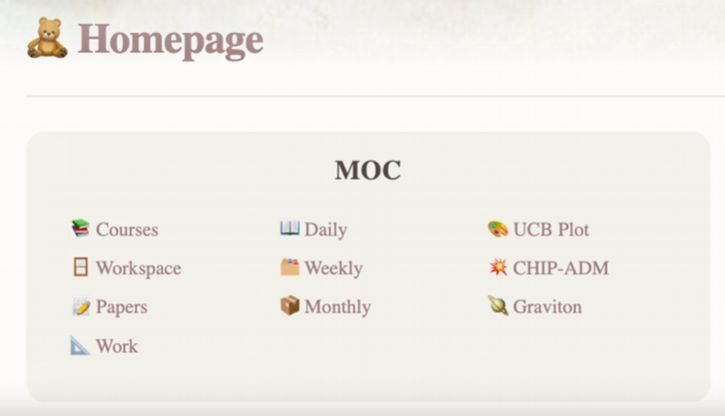
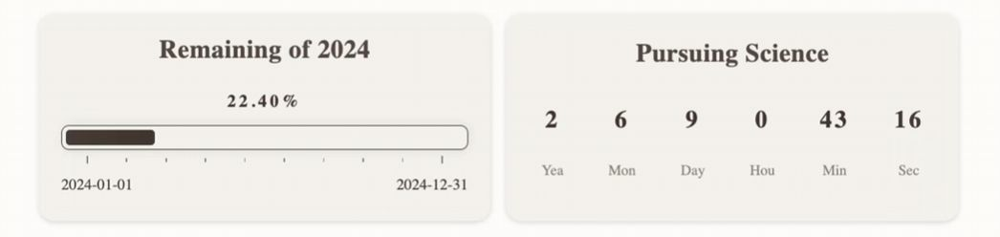
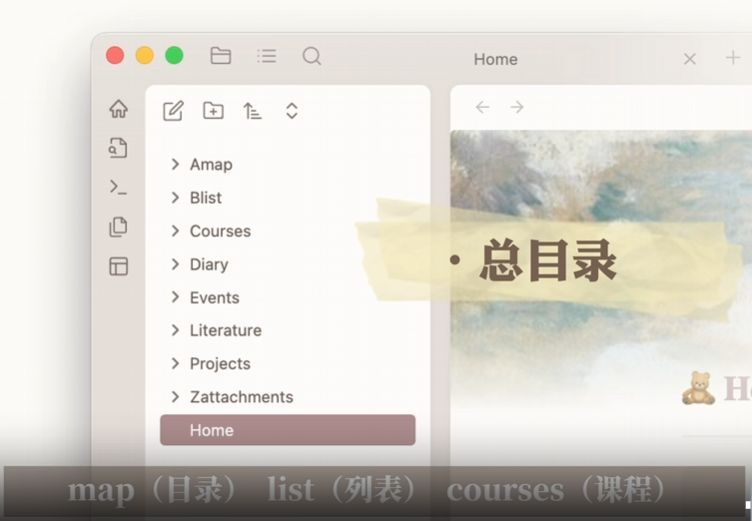
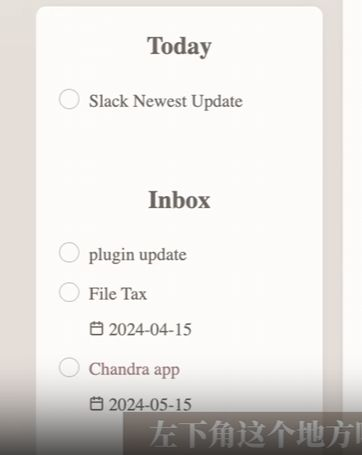
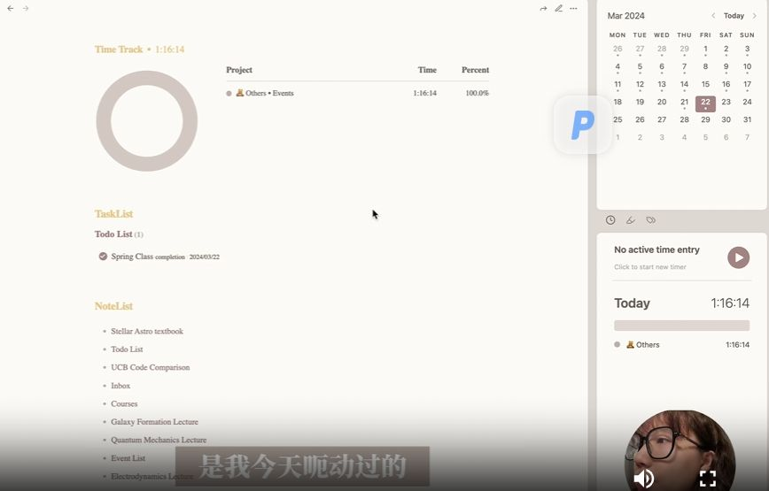
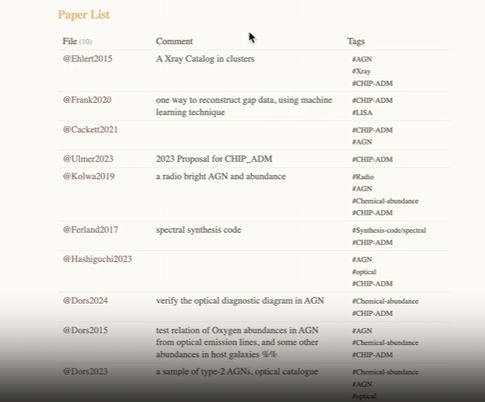

 #自驱力 #知识管理 #学术科研 #待办事项 #文献 #生活库双链 
## 全文摘要

一位个人面对长期挑战，包括对电影、书籍和学习资料的过度收集以及整理和管理上的拖延。他自责于“拖延”和“缺乏自驱力”。后经朋友建议，开始使用Obsidian笔记软件，通过创建、链接笔记，使用标签和插件等功能，逐渐提升学习和科研效率。郭操操通过搭建个人工作平台，在学术上取得进步，并萌生创建生活库的想法，旨在整理学习工作之外的内容，进一步提升生活质量。这段经历旨在激励他人通过合适工具和技术改善工作和学习流程。

## 从混乱到有序：提升自驱力的笔记整理之旅

分享了个人在学术和生活管理上的混乱状态，包括待看清单的遗忘、收藏资源的无效利用以及任务拖延等问题。通过引入笔记软件，开始尝试整理学术文件，以此作为提升自驱力、改善生活和工作流程的起点，旨在逐步恢复个人的主动性和效率。
日程完全由我的课程会议还有讲座来控制
## Obsidian：科研与学习的高效笔记工具

Obsidian作为一款本地化的知识管理软件，以其双链、标签功能及活跃社区脱颖而出。通过自定义搭建，用户可构建适合个人需求的工作平台，涵盖课程、科研项目等多方面，实现高效科研与学习。演示中，通过添加春季课程笔记，展现了Obsidian在日常使用中的灵活性与实用性。

undefined 07:04 Obsidian效率提升与学术库构建

分享了如何使用Obsidian工具提升学习和工作效率，包括任务管理、时间记录、笔记创建与整理，以及科研项目管理，强调了工具使用与个人习惯结合的重要性，展望了构建生活库以实现全面知识管理的目标。

## 左上角是整个库下面的目录
主页

进度条

热力图

map（目录
list （列表
courses（课程
diary（日记
event （事件
literature（文献
project（项目

## 左下角是 #今日待办 ， #暂存箱

#计时插件 toggle check

## 每日干活记录
首先是一个时间戳的功能，我一般用它来记一些有的没的东西。像现在这样，如果我们打开日记的话，就可以看到刚刚我打的那句话，以及当时的时间，就放在了我日记的这个capture的标题下面。在干活之前，我会先查看一下我左下角的这个待办事项。然后我会看到有一些已经完成的任务还没有给它归档起来。所以我会选择这个archive tasks，把我的inbox还有today，其实那个已经是昨天已有的任务了。把这些东西全部都给移走，我们就可以开始创建任务了。你会看到在inbox这一行里面就多了一个叫spring class的任务。除此之外，如果我想说，比如说我刚刚遗留的那一个任务，我想再重新把它放回我今日的代办清单里面。那么我只需要在我现在这个to do的栏里面找到刚刚那个任务，然后复制一下它的连接。然后再把它输入到today这一栏里面，它就会出现在我左下角的今日待办里。

### #计时插件 archive tasks

###### today日历
###### tasklist 任务清单
###### notelist 笔记

任务完成后，在任务栏上面打勾，就会自动填充完成这个任务的日期，然后我再停掉这个任务的计时。如果打开日记的话，就会看到刚刚记录的这一段工作的时长，还有我完成的任务都被放进我的日记里。然后下面这个note list是我今天动过的，就是修改过和创建过的一些笔记，全部都会放到日记里面去。同样的，如果我在勾选这个today栏下面的任务的话，它也会出现在我已完成的task list里面。

###### 精读教科书
PDF阅读器+插件
##### inbox
创建任务

todo栏存放所有代办
##### 课堂笔记
课堂卡片
在templates里选courses
记得使用模板提高效率

workload是我项目的工作记录日期，下面都是我当天做的事情。而这个pay less则是跟这个项目相关的文章。点开其中一篇文献，就会有这篇文献的信息总结。
paperlist 项目关联文章

这里的task list，还有question list，是我在工作中遇到需要后续跟进的东西，点击这里就会跳转到我这个待办所在的位置。而如果这个问题已经解决的话，我会直接在这里给它打勾，它就会自动从我这个list里面删除，但还会保留在原来的位置。

## 要点回顾

大家有没有经历过明明对电影、电视剧、书籍或各类知识有广泛兴趣，并且做了收藏打算，但最终这些收藏并未被打开使用的情况？

我也有过这样的经历，我发现自己有很多电影、教程视频和笔记收藏，但往往到最后都没有去点开看过。

你能否分享一下你在研究生生活中体现出的“P人特性”具体体现在哪些方面？

我的“批人特性”主要体现在三个方面：一是我的科研文件、笔记等分散在电脑和iPad的不同APP中，缺乏系统的管理；二是我的日程完全由课程会议和讲座控制，在自由时间里容易陷入反复刷剧的惰性；三是面对任务时，通常会拖延到DDL前一两天才开始行动，甚至有些任务会被拖到完全忘记。

是什么导致你决定改变这种状态并采取行动？

今年年初，我在美国放完寒假开学后，发现自己除了上课以外，几乎没有进行作业、科研和参加讲座组会，陷入了严重的懒拖延状态。我意识到自己缺乏自驱力，急需自救。

你是如何找到解决方案并开始整理自己的学术文件的？

当时我的一位好朋友在他的公众号上推荐了一个叫Obsidian的笔记软件，这激发了我想用它来整理混乱不堪的学术文件，并通过构建工作流程，找回自我驱动能力的想法。

Obsidian软件有哪些特色功能吸引了你？

Obsidian作为一款本地的知识管理软件，它的双链和标签功能以及活跃的用户群体和丰富的插件市场是我认为的最大特色。此外，它可以高度自定义，但同时也由于这一点对于新手来说可能存在一定的学习门槛。

目前你在Obsidian的工作区是如何布局的？

我的工作区主要包括主页的内容目录，其中包含了重要文件的大纲链接；下方有任务清单自动收集代办事项，进度条显示工作状态，还有贡献度热力图等。

## 你是如何利用Obsidian进行科研和学习工作的？

我会利用其时间戳功能记录日记，并根据待办事项调整今日待办清单。例如，在春季开学时，我会查看已归档的任务，创建新的课程任务，并通过移动任务链接的方式将其重新安排至今日待办清单中。

在完成代办计划后，你是如何确认自己的工作时间并开始计时的？

在确认工作时间时，我会选择check功能，菜单栏会跳出四个选项对应待办栏里的任务。点击spring class并将它放入相应项目中，系统就会开始计时。

如何将课程信息添加到笔记系统中并创建课堂笔记？

首先通过点击相应课程链接将其添加到课程列表中，然后在 templates 文件夹内选择 course 模板，并输入课程链接名称以生成新的课堂笔记。

完成任务后，系统如何记录并管理这些任务信息？

当任务完成后，在任务栏上打勾确认，系统会自动填充完成日期并停止计时。同时，任务详情会被记录在日记中，包括工作时长和完成的任务，并且今日动过的笔记和修改内容也会被记录在 note list 中。

你如何使用 margin note 阅读器结合 Obsidian 进行学术研究？

我选择了 margin note 作为 PDF 阅读器，并与 Obsidian 联动，通过插件进行拆书和输入个人理解，方便查看和引用原文内容。

科研部分在 Obsidian 中是如何组织和展示的？

科研课题放在主页下的 MOC 文件夹中，每个项目拥有一个看板，记录工作日志和相关文献信息。同时，可以将 rota 摘录笔记联动到 Obsidian 侧栏，并能直接跳转到原文位置，而 task list 和 question list 则用于跟进工作中遇到的问题，问题解决后可勾选删除。

对于目前 Obsidian 学术库的构建情况如何？是否规划了一个生活库来整理学习工作以外的内容？

目前学术库还在初步阶段，有许多整理工作尚未完成，流程还需完善。但在逐步搭建过程中，已经能够梳理自己的工作习惯，并学习提高效率的工具，将成果应用于科研和学习中，从而激发更大的热情。是的，我计划建立一个生活库来储存和整理除学习工作外的其他内容，使其成为真正的“第二大脑”。如果生活库构建完成，将会再次分享给大家。