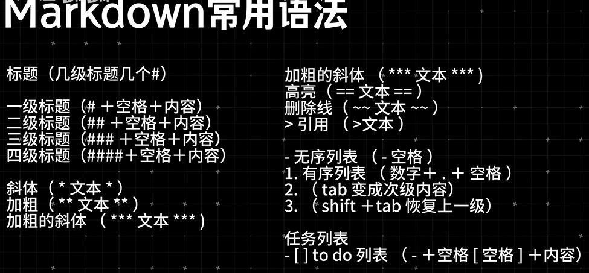

标题（几级标题几个#）

一级标题（#+空格+内容）
二级标题（## +空格+内容）
三级标题（### +空格+内容）
四级标题（###井+空格+内容）

-无序列表（-空格）
1. 有序列表（数字+.+空格）
2. （tab 变成次级内容）
3. （shift +tab 恢复上一级)

斜体（*文本*）
加粗（**文本**）
加粗的斜体（***文本***）
加粗的斜体（***文本***）
高亮（==文本==）
删除线（~~文本~~）
＞引用（＞文本）

任务列表
-[] to do列表（-+空格[空格]+内容）
