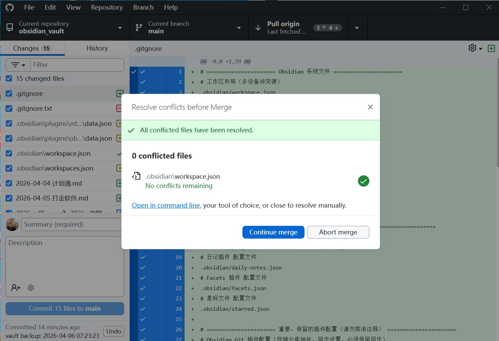
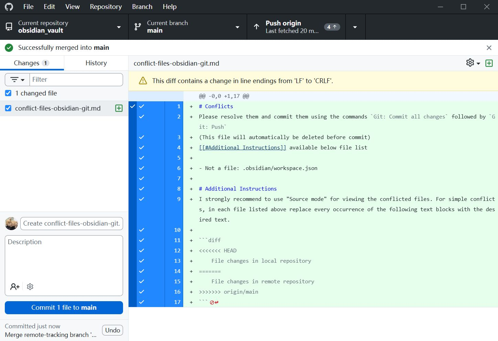

1固定时间点睡觉 2遵循90分钟睡眠周期 3睡前60分钟放松 4醒来后不碰手机，出门晒10分钟的太阳 5醒来后立即用冷水洗脸并运动 6下午2点以后不摄入咖啡因 7待在黑暗凉爽安静的房间 8睡前清空思绪，在清醒状态写日记 不用谢


## 🔧 步骤 1：修复根源问题（.gitignore 后缀错误）

你之前的 `.gitignore.txt` 带了 `.txt` 后缀，Git 完全不识别，导致 `workspace.json` 一直被跟踪、反复冲突。

1. 在文件管理器找到 `.gitignore.txt`，**重命名为 `.gitignore`**（开头是英文 `.`，必须去掉 `.txt` 后缀；Windows 需先开启「显示文件扩展名」）
2. 确认文件内包含以下规则（已有则无需修改）：
    
    gitignore
    
    ```
    .obsidian/workspace.json
    ```
    
3. 作用：永久忽略该文件，彻底杜绝同步冲突。

---

## ⚡ 步骤 2：强制推送，用本地覆盖远程（一键解决所有冲突）

### 方法 A：Obsidian 插件内操作（新手友好，零命令行）

1. 按 `Ctrl/Cmd + P` 打开命令面板，执行 **`Git: Commit all changes`**（提交你修复 `.gitignore` 的修改，自动标记冲突已解决）
2. 再执行 **`Git: Push (Force)`**（强制推送，直接用本地的所有内容覆盖 GitHub 远程，无视冲突）
    
    - ⚠️ 找不到该命令？前往「Obsidian 设置 → 社区插件 → Obsidian Git → 设置」，开启 **`Allow force push`（允许强制推送）**，重启 Obsidian 后即可出现
    
3. 完成后，冲突自动消失，`conflict-files-obsidian-git` 提示文件会自动删除。

---

### 方法 B：命令行操作（100% 生效，找不到插件命令时使用）

1. 打开你的 **Obsidian 笔记库根目录**（与 `.obsidian` 文件夹同级）
2. 在文件夹空白处右键，选择「在此处打开终端 / 命令提示符」
3. 依次执行以下 3 条命令，每条执行后回车：
    
    bash
    
    运行
    
    ```
    # 1. 取消当前卡住的合并，恢复仓库正常状态
    git merge --abort
    
    # 2. 把所有修改（包括修复后的 .gitignore）添加到暂存区
    git add .
    
    # 3. 强制推送，用本地完全覆盖 GitHub 远程 main 分支
    git push -f origin main
    ```
    
4. 回到 Obsidian，刷新 Git 面板，所有冲突全部清空。

---

### ⚠️ 重要风险提示

`Git: Push (Force)` / `git push -f origin main` 属于**不可逆操作**，会永久删除 GitHub 远程仓库中未同步到本地的所有修改，请务必确认本地内容为最终版本后再执行。

## 笔记本GitHub桌面情况

### 🔍 当前状态解读

1. **核心提示**：弹窗显示 `All conflicted files have been resolved.`，说明你已经手动解决了合并冲突，目前 `0 conflicted files`，没有残留冲突文件。
2. **文件信息**：冲突文件是 `.obsidian/workspace.json`，这个文件是 Obsidian 的工作区布局配置，也是多设备同步时最容易发生冲突的文件。
3. **下一步选项**：弹窗给了你两个操作：
    - `Continue merge`：继续完成合并流程
    - `Abort merge`：放弃这次合并，回到合并前的状态
 
 ### 🔍 当前状态解读

4. **合并已成功完成**：界面顶部提示 `Successfully merged into main`，说明你刚才的合并操作已经顺利完成，没有残留冲突。
5. **自动生成的临时文件**：当前待提交的文件 `conflict-files-obsidian-git.md`，是 Obsidian Git 插件在处理冲突时自动生成的临时说明文件，用来指导你解决冲突。这类文件通常在提交前会被自动删除。
6. **行尾符警告**：黄色提示 `This diff contains a change in line endings from 'LF' to 'CRLF'`，是 Windows 系统特有的换行符警告，说明文件的换行格式从 Unix 的 `LF` 被改成了 Windows 的 `CRLF`，这在跨平台协作时很常见，不会影响你的仓库功能。

### ✅ 接下来的正确操作

#### 步骤 1：先清理临时文件

这个 `conflict-files-obsidian-git.md` 文件是冲突处理的临时产物，**不应该提交到仓库**。

- 在 GitHub Desktop 中，右键点击这个文件 → 选择 `Discard changes`，直接删除它。
- 或者在文件资源管理器里手动删除这个文件即可。

#### 步骤 2：提交并推送合并结果

1. 确保 Changes 列表里只剩下你真正修改过的笔记文件（如果还有的话）。
2. 在左下角填写提交信息（比如 `Merge remote changes`），然后点击 `Commit 1 file to main` 完成提交。
3. 提交完成后，点击界面顶部的 `Push origin`，把本地的合并结果推送到远程仓库。

---

### 🛠️ 解决换行符警告（可选，一次性配置）

如果你不想再看到行尾符警告，可以在仓库根目录配置 `.gitattributes` 文件，让 Git 自动处理换行符：

1. 在你的 `obsidian_vault` 根目录新建文件 `.gitattributes`
2. 写入以下内容：
    
    gitattributes
    
    ```
    * text=auto eol=lf
    *.md text eol=lf
    *.json text eol=lf
    ```
    
    这个配置会强制 Git 把所有文本文件的换行符统一为 `LF`，避免跨平台的换行符差异问题。

---

### 💡 额外建议：从根源避免冲突

你之前遇到的 `.obsidian/workspace.json` 冲突，是 Obsidian 多设备同步的常见问题，除了之前说的在 `.gitignore` 里忽略它，还可以这样优化：

- 在 Obsidian 设置中，关闭「自动保存工作区」功能，减少不必要的文件修改。
- 优先使用 Obsidian Sync 官方同步功能，搭配 Git 做备份，避免 Git 频繁处理配置文件冲突。

---

### ❌ 不建议做的事

- 不要直接提交这个 `conflict-files-obsidian-git.md` 文件，它会污染你的仓库，并且没有任何实际作用。
- 不要在文件里修改内容，它只是一个临时说明文档，删除即可。

如果你需要，我可以帮你写一份完整的 `.gitattributes` 和 `.gitignore` 配置模板，直接复制就能用，彻底解决换行符和配置文件冲突问题。