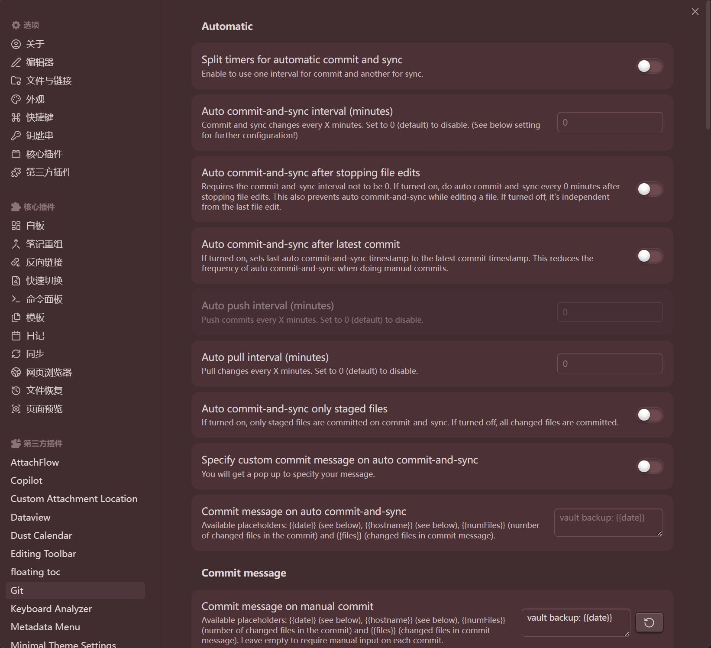

## 安装git以后，还需要怎么样配置，才能运行obsidian中的git插件呢

顶上“git is not ready...” 你的.git文件和.obsidian文件不在同一级目录下，你拉到同个目录下

重新打开右上角显示这个 Cannot run git command. Trying to run:'git'

在你的仓库文件夹中右键选git bash，然后把你github网站上新建仓库时，有一个SSH代码复制到git程序中，授权登录，运行，ok