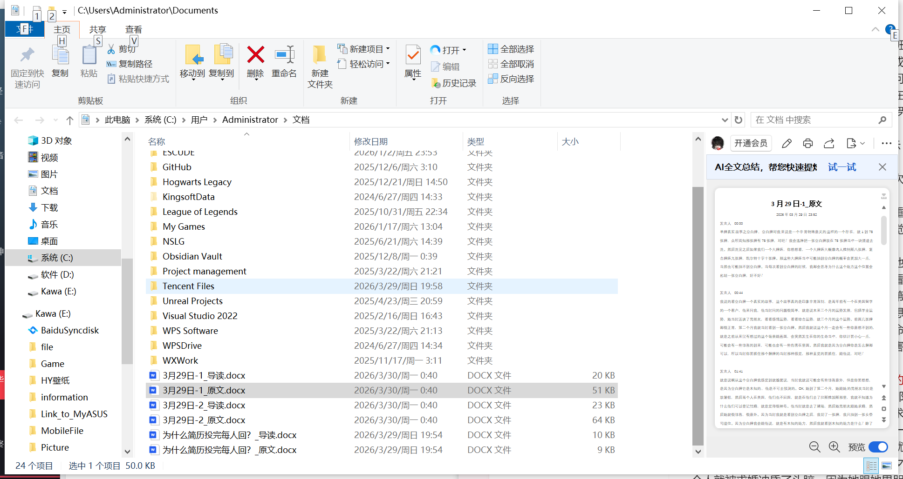

C:\Users\Administrator\Documents

#女皇牌 #大牌阵 #魔术师  #皇帝牌 #空白牌  

#凯尔特十字 #女祭司逆位 感情运势 运势 头元素 冷眼旁观 权杖 祈祷 神圣 甘地 资源

塔罗牌对个人经历的影响，包括全日制西班牙语课程的启示、面对挑战的决心、以及星星牌、月亮牌等对情感和个人成长的启示。通过具体案例，塔罗牌不仅揭示了爱情、职业和自我成长中的问题与挑战，还提供了成长、释放和自我反省的路径。讲述者强调了塔罗牌在理解内心世界、接受生活变化和追求个人价值方面的重要作用，展现了塔罗牌解读的多样性和深度意义。
######  预示未知的 #空白牌 ：一场意外婚姻的启示

空白牌在塔罗牌阵中象征未知与惊喜，一次解读中，咨询者因空白牌提示的意外惊喜，经历了一场拉斯维加斯的闪婚。半年后，咨询者因婚姻问题寻求再次解读，揭示了女祭司逆位的警示未被重视。这一案例强调了空白牌在预测个人生活转折点中的特殊意义，以及直觉解读的重要性。

是两年前有一个在美国留学的一个客户，他来问我未来三个月的运势发展，包括学业运势，她当时还谈了男朋友，看看感情运势，看看综合运势，就三个月的这个运势。前面几张牌都很正常，第二个月我就当时看到一张空白牌。然后我就说这个月一定会有一些你意想不到的，就是之前从来没有想过的这个场景跟画面，会突然发生在你的生命当中，你估计要小心一点，可能会有一些惊喜的到来，可能也会有一些伤害在里面。

因为空白牌它是未知的，他是不可去预测的。她到了第二个月，跟她的男朋友放暑假，他们两人去了美国拉斯维加斯那里登记结婚，就是觉得很神奇。他当时就是去了赌场，然后她男朋友跟她求婚，然后她就很惊喜，很意外。因为当时我就是看到空白牌之后，我切到一张 #女祭司逆位 。因为空白牌我会跟他说，就是有未知的地方，然后我就看到未知的地方是什么？当时他们在是荒漠之城，非常美丽的什么绚烂的夕阳，突然的跪地求婚，就让她整个人就被求婚冲昏了头脑，因为她跟她男朋友也算是经历了一些东西才能在一起的，然后就很快答应了。

我觉得可能他们回国还会正式领证什么的，他们就这么在一起了，真的是很惊喜，很意外。当然我觉得每个女生被求婚算是没有人会觉得很突兀或者是非常的。当然除非这个人是你不爱的人，就算是闪婚。然后半年之后他就这个女生问脖子又重新找回到我，她跟我反馈说龙女我离婚了。

如果当时我把女祭司逆位解得再再恐怖一点，他可能会避开这一场灾难。或者可能会听到我的话就说要保守一点，慎重一点。可能后面他们就在发现彼此的一些东西可能不合适分开了或者怎么样，就是可能会晚一点结婚。

Anyway，这个是已经发生了，大阿卡纳牌，这个大胜利牌，这是命中注定该经历的这样的一个课题。后面他们就离婚了。这个女生还好没有小孩，后面也过上了她自己正常想要的呼吸的这样的一个生活。空白牌也算是一段短暂的婚姻，维持大概半年左右的一个婚姻案例。

######  04:57 #魔术师牌 与金钱交易的风险提示

讨论了魔术师牌象征的表演者特质，强调在金钱交易中需警惕其表面魅力，避免仅凭言辞和外貌建立信任，指出风元素的吸收性可能导致不稳定关系，建议追求长久关系时需注重实质而非表面现象。

###### 07:38  #女祭司牌逆位 ：感情中的冷静与自我调整

探讨了女祭司牌逆位在感情中的表现，强调了其带来的冷漠生疏感和需要冷静旁观的重要性。通过具体案例，说明了牌面逆位状态下，因恐惧而非理智做出调整的倾向，以及保持距离以更客观分析全局的建议。

###### 11:47  #女皇牌 的深层含义与个人成长启示

对话深入探讨了女皇牌在塔罗牌中的多重象征意义，包括其表面上的温柔与内在的强大，强调个人应识别并利用自身的核心竞争力。同时，通过女皇牌的正逆位解析，提出适时放松与自我滋养的重要性，倡导在努力与享受间找到平衡，以实现个人潜能的充分发挥。

###### 16:47 塔罗牌与情感： #皇帝牌 背后的真实故事

通过塔罗牌的解读，尤其是皇帝牌，揭示了一段复杂的情感关系。皇帝牌象征着强势与控制，但并不意味着感情专一。在故事中，一名女生深受皇帝牌男生的控制，但通过塔罗牌的启示，最终选择离开，找到了更温柔的伴侣。这故事展示了塔罗牌在情感分析中的应用，以及个人选择的重要性。

###### 22:53  #教皇牌 与宗教权威的反思

对话深入探讨了教皇牌的象征意义，特别是其在宗教权威与个人依赖心理之间的复杂关系。通过分析电影《聚焦》中的案例，揭示了宗教权威可能对弱势群体，尤其是儿童，造成的严重伤害。同时，对话也触及了个人在情感依赖上的心理状态，指出过分依赖他人，尤其是处于权威地位的人，可能带来的不平等关系。最后，对话提醒在一对一婚姻制度下，需警惕‘三位一体’象征的复杂关系，避免情感上的不健康依赖。

###### 27:37 塔罗牌解读： #恋人牌 与人生选择权的探讨

对话深入探讨了塔罗牌中恋人牌的含义，将其与《圣经》中的伊甸园故事联系起来，强调女性在年轻时拥有更多选择权，而男性随着年龄增长则逐渐掌握主动权。恋人牌象征着广泛的探索与沟通，而非立即的选择，鼓励人们在年轻时大胆尝试不同的关系，把握生命中最为灿烂的时光。同时，通过对比恋人牌与恶魔牌，阐述了选择权随年龄变化的动态平衡。

###### 32:57  #战车牌 下的艰难旅程与自我加压

分享了两次因抽到战车牌而经历的挑战：一次是在悉尼参加婚礼时，因迷路和坐错车，2.6公里的路程走了近4小时，最终迟到但幸运赶上婚礼；另一次是学习西班牙语时，自我加压导致进度缓慢，国庆假期计划背单词书也未能坚持。

###### 37:42 塔罗牌与双生火焰：阴阳融合的象征

讨论了塔罗牌中的力量牌象征双生火焰的诞生与成长，强调阴阳两性的极端融合。单身者抽到此牌预示遇到性格完全对立的伴侣。乐队贝斯手案例解释个人力量需融入团队，电竞选手的团队力量大于个人力量。力量牌象征男女高度融合的性关系，展现和谐与竞争并存的场景。

###### 41:11  #隐士牌 与个人成长：从闭关到蜕变的旅程

通过讨论影视牌的意义，分享了一段从广州水晶店店主到上海个人成长的旅程，包括卖水晶、泡图书馆、冥想闭关等经历，体现了影视牌作为独处与自我充电象征的作用，以及个人在不同阶段的自我探索与成长。

###### 47:41  #命运之轮 ：塔罗牌揭示爱情与人生转折

通过一个具体的案例，探讨了塔罗牌中的命运之轮牌在预测个人情感走向和生活转折点上的作用。案例中，占卜者准确预测了一位女性客户的男友将与他人结婚，但最终命运之轮带来转机，使她遇到了真爱。这一过程展示了命运之轮牌的深层含义——经历低谷后迎来重生，强调了在人生起伏中保持积极态度的重要性。此外，命运之轮牌在其他事件预测中的准确性，如马航事件的结局，进一步验证了其作为命运馈赠的象征意义。

###### 55:16  #正义牌 的启示：正义与隐藏的秘密

正义牌象征着隐藏的秘密最终会揭露，无论是婚外情还是个人的真实想法。逆位的正义牌强调过去的秘密被揭示，提醒人们要多做善事。牌面露出的脚暗示无法完全隐藏真相，正义牌也代表总结经验和遵循成熟框架解决问题。

undefined 01:00:15 吊人牌与自我牺牲：塔罗牌解读

吊人牌在塔罗牌中象征牺牲与奉献，正位或逆位都可能让人陷入自我牺牲的循环，无法抽离。通过个人经历分享，强调在忙碌或不幸关系中短暂休息的重要性，以及识别并脱离自我牺牲模式的必要性。

undefined 01:05:10 塔罗牌与情感转折：死神牌的启示

通过回忆与前健身教练的情感预测经历，阐述了塔罗牌死神牌的象征意义，即任何关系都有其终结时刻，无论是分手还是结婚。强调死神牌代表自然的结束与开始，以及在合适时机终结关系的重要性。分享了通过塔罗牌预测并见证多段关系发展的故事，最终感悟到生命中该来的总会来，该结束的也会结束，新旧交替是自然规律。

undefined 01:09:55 塔罗牌节制与死神：灵魂状态与情感抽离

讨论了塔罗牌中节制牌与死神牌的意义，以及它们在情感状态和生活决策中的象征作用。节制牌被比喻为情感上的抽离和迷茫，而死神牌则代表肉体的结束与灵魂的持续。两者结合分析了个体在经历重大挫折后的恢复过程，建议给予自己时间和空间进行修复，避免在元气未复时做出重要决策。

undefined 01:15:48 恶魔牌：物质支持与情感依赖的双刃剑

对话探讨了恶魔牌在塔罗牌中的意义，从初次抽到恶魔牌的不理解，到逐渐认识到其代表的物质支持和情感依赖的重要性。通过逃荒时期有如神助的陪伴、囚徒定律的解释以及日本黑社会的规矩，阐述了恶魔牌在特定情境下的正面作用。同时，分析了恶魔牌在感情关系中的特点，即双方难以独立，需紧密相连，以及在工作上表现出的勤奋努力。最后，分享了一段类似恶魔牌关系的真实经历，强调了适时逃离不健康关系的重要性。

undefined 01:20:53 高塔牌与个人挑战：语言学习的激烈体验

通过分享个人经历，详细描述了在2018年冬季决定报名全日制西班牙语课程时遇到的种种挑战。起初，高塔牌预示着激烈的学习环境和压力，但即使面对工作、健康和个人事务的频繁干扰，仍坚持回到课堂。尽管最终未能完全掌握语言技能，但这段经历展示了面对逆境时的不屈不挠和自我提升的努力。

undefined 01:26:05 星星牌：灵魂洗涤与情感独立

星星牌在塔罗中象征灵魂的洗涤和独立，即使在有现任的情况下，也能遇到激励自己成长的特别之人。通过八年的陪伴，一个男生帮助一个女生从自卑到自信，实现自我蜕变。星星牌强调的是情感中的独立空间和精神激励，即使双方无法在一起，也能成为彼此生命中的重要力量，促进个人成长和灵魂净化。

undefined 01:30:49 月亮牌：揭示情感中的隐蔽与复杂

月亮牌象征着情感中隐蔽而复杂的一面，与个人过往经历紧密相连，尤其是童年的原生家庭影响。它代表了无法轻易言说的爱恨情仇，如未公开的恋情、婚外情或童年创伤。月亮牌揭示了人际关系中不可见光的深层次情感，强调了塔罗牌对复杂情感的认可与解读，以及这些情感对个人成长的深远影响。

undefined 01:35:43 太阳牌在塔罗中的象征意义与个人经历分享

太阳牌在塔罗中象征着热烈、快乐和艺术人生，其能量强大到能灼烧其他牌，代表极大的消耗与绽放。个人经历分享了太阳牌带来的旅行快乐，即使在经济条件有限的情况下，也能体验到无比的开心与满足。同时，太阳牌在感情与工作中的解读需结合其他牌进行，如同篝火晚会，虽热闹但需注意内心的敏感与后续的散场。

undefined 01:38:30 大牌解读与实际应用探讨

对话深入探讨了塔罗牌中太阳牌、大火牌、审判牌等大牌的含义与实际应用，强调了太阳牌作为速成班或短期目标的象征，以及大火牌需搭配其他牌以避免短期的剧烈影响。同时，审判牌被解释为特定时间和空间下的转折点，反映了大环境对个人运势的影响。

undefined 01:40:40 审判牌：命运与时空的指引

审判牌象征着特定时间和空间的指引，它暗示着在某一时刻遇到的人或事是命运的安排，强调了在特定时空下做出选择的重要性。此牌鼓励个人聆听内心的声音，相信冥冥之中的安排，从而在事业、感情或生活方式上做出符合内心真正意愿的决策。通过审判牌的解读，人们被引导去接受既定的事实，减少对过去决策的自责，活在当下，相信每个选择都是成长的必经之路。

undefined 01:45:15 世界牌：完美主义与情感选择的困境

对话探讨了世界牌在塔罗牌中的含义，尤其是它与个人完美主义倾向的关系。当世界牌出现在牌阵中较后位置时，被视为一种定心剂，象征成熟与完美。然而，若在早期出现，则可能成为无法跨越的障碍，代表个人过于自我中心，难以接受变化或新的情感机会。案例分析指出，持有世界牌的人往往设定高标准，生活圈封闭，且倾向于利己主义，这可能导致他们在情感关系中遇到困难，尤其是在寻找伴侣或做出选择时。世界牌强调个人已达到完美状态，但同时也揭示了个体意识不到自身不完美及外界多样性的局限。

undefined 01:50:17 权杖X与宝剑骑士：意志与现实的交织

对话探讨了权杖X和宝剑骑士牌的象征意义，强调个人意志对实现目标的重要性。权杖X代表坚定的意志和不屈不挠的精神，而宝剑骑士则象征着不灭的希望和内在动力。同时指出，对于无法实现的愿望或目标，即使有强烈的意志，也需正视现实，认识到某些强弱对比下的不可能性。